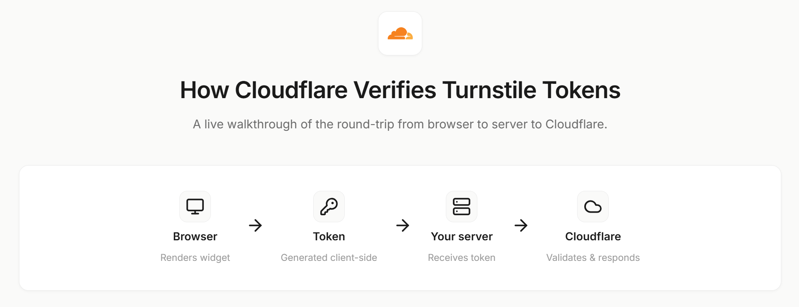

# CF Turnstile Demo

An interactive demo that shows exactly how [Cloudflare Turnstile](https://developers.cloudflare.com/turnstile/) verifies tokens between the browser, your server, and Cloudflare's siteverify endpoint.

Built to make the full verification flow easy to understand. Pick a scenario, watch the token get issued, then see how the server validates it.



## Features

- **Scenario-based walkthrough** — try "Successful login", "Bot blocked", "Replay attack detected", "Mismatched keys", or build your own
- **Browser ↔ Server split view** — see what happens on each side of the request
- **All 5 Cloudflare test sitekeys** — visible pass/fail, invisible pass/fail, and forced challenge
- **All 3 Cloudflare test secrets** — always pass, always fail, and timeout-or-duplicate
- **Live status guidance** — the UI tells you what to do at each step
- **Plain-English result summaries** with collapsible raw JSON for the curious
- **Error code reference** built in

## Tech Stack

- Flask + Jinja2
- Vanilla JavaScript
- Cloudflare Turnstile (test keys)
- Lucide icons, Inter + JetBrains Mono fonts

## Getting Started

```bash

git clone https://github.com/nishatrhythm/CF-Turnstile-Demo.git

cd CF-Turnstile-Demo

pip install -r requirements.txt

python app.py
```

Then open [http://localhost:5000](http://localhost:5000).

## How It Works

1. **Pick a scenario** — this loads a sitekey (public) and secret key (private) combo
2. **Complete the widget** — Turnstile issues a token to the browser
3. **Send to server** — the server forwards the token + secret to Cloudflare's `/siteverify` endpoint
4. **See the result** — Cloudflare responds with `success: true/false` and any error codes

## Resources

- [Cloudflare Turnstile Docs](https://developers.cloudflare.com/turnstile/)
- [Testing with Dummy Keys](https://developers.cloudflare.com/turnstile/troubleshooting/testing/)
- [Error Codes Reference](https://developers.cloudflare.com/turnstile/troubleshooting/client-side-errors/error-codes/)

## License

MIT